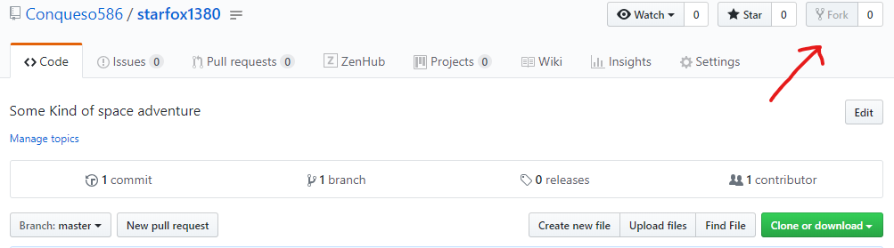
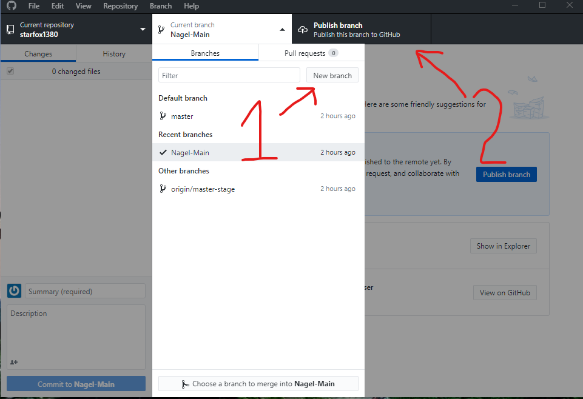
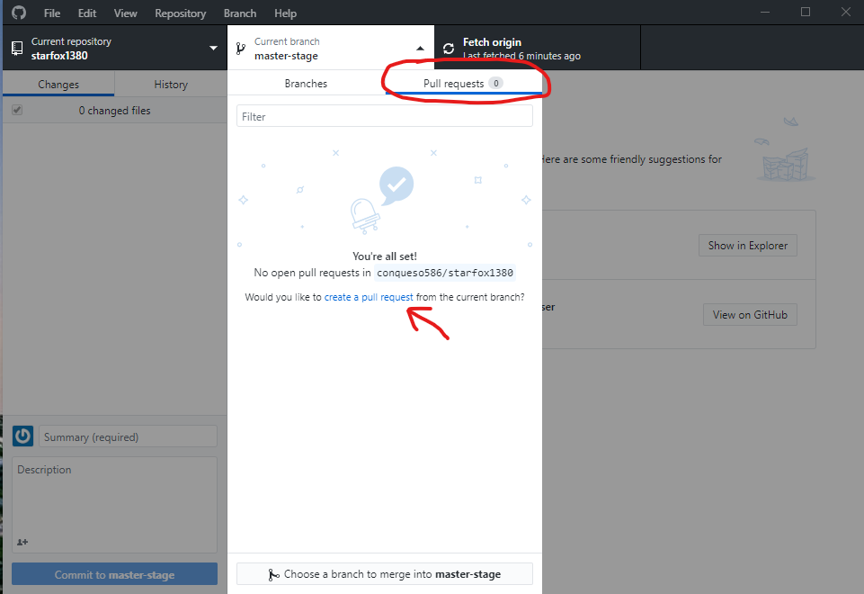
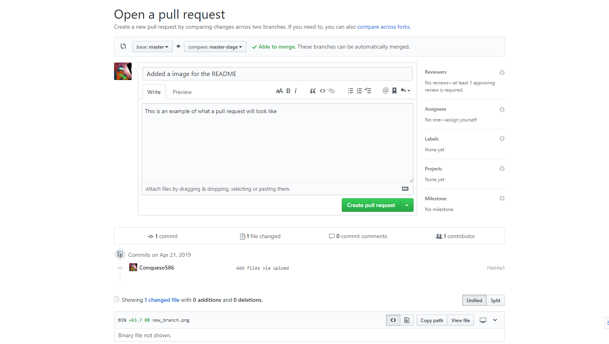
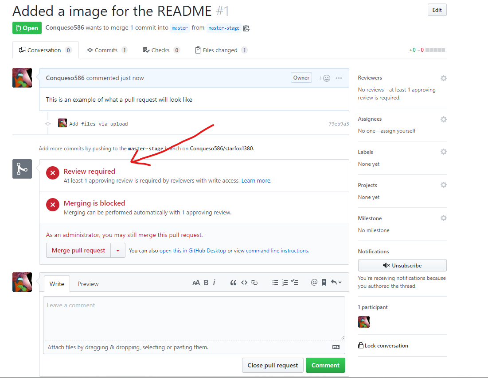
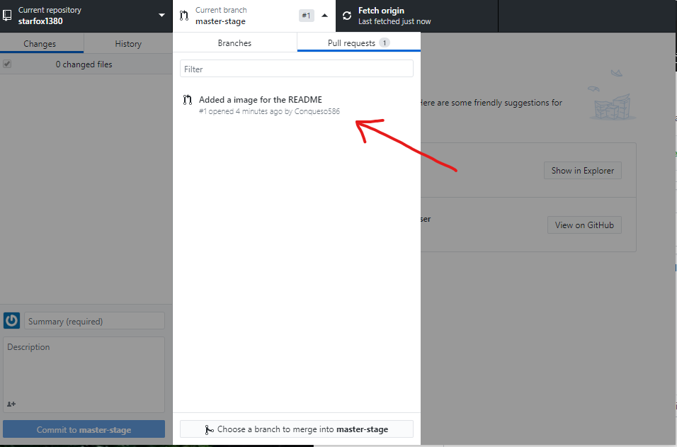
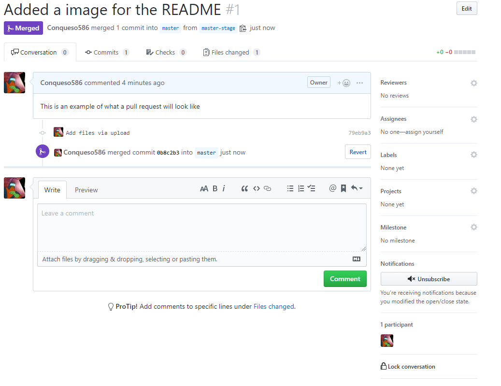

# Starfox1380
Some kind of space adventure in 3D SPACE

## Trello Board

Issues will be posted at https://trello.com/b/Imqj66By/starfox1380 for now.
Talk to Joe about an invitation

## Contributing

Forking the repo - **Requires a github account**

This will add a copy of the repository and it's branches to your github account. You will commit changes to your fork.
   
### Creating a branch for your work

**When starting work on a new aspect of the project it is highly recommended that you maintain a few branches simultaneously to make version control easy and avoid losing your hard work.**

You can use a version control software like github desktop, svn, mercurial, etc. But for this example I'll be using github desktop.

To create a new branch

1. Click the new branch button as shown below and enter a name for the branch.
2. Publish the branch to Github

You're ready to start working on your new branch

### Submitting a pull request

Once you've added or changed code and are comfortable with the features you've added, you will need to submit a pull request to the master-stage branch.

The master-stage branch will be the branch everyone will contribute to. When we have made enough progress and the branch is stable, the master-stage will be merged into master.

#### Create a pull request
You must write a pull request from github itself. You can start your first PR from github desktop.

This will open a web browser to the project git repository where you will create the pull request. Please write the details of your changes in the comment box provided. Below you will see that the number of commits as well as the changed files are shown. Once you are ready click the green "Create Pull Request" button.

#### Ready for review

Once your pull request is created. It will be posted for review by one of our admins.

You can track all the open pull requests from your Github Desktop

When your code is reviewed and given the green light, it will be merged with the desired branch.

Their are a bunch of great features that come along with using pull requests. Go ahead and play around with them!

If you want to learn more about the in's and out's of pull requests, click the link below.

https://help.github.com/en/articles/about-pull-requests
